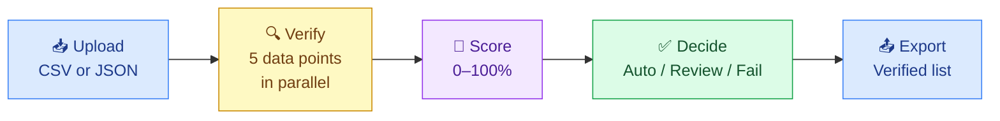
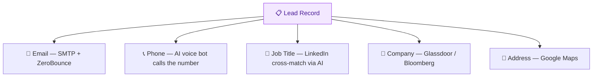
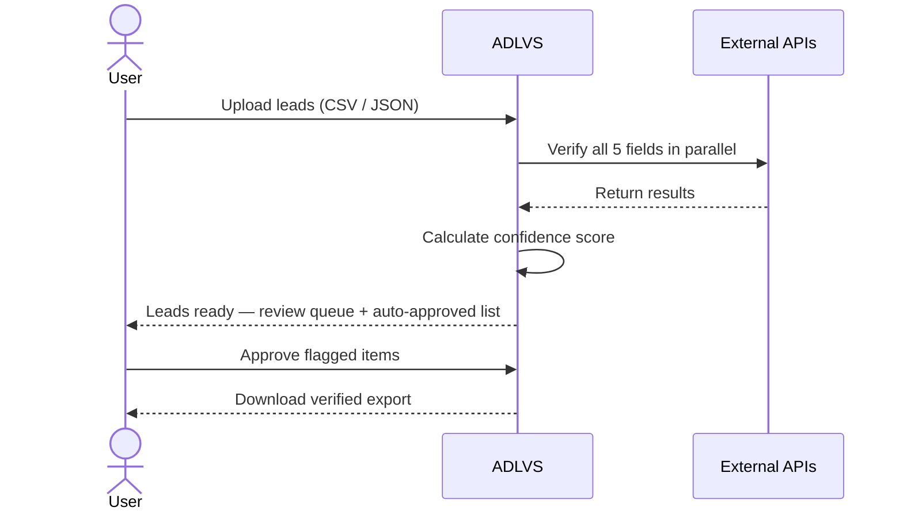

# Overview

ADLVS replaces a 24-hour manual lead verification process with an automated engine that runs in under 3 hours. It checks every lead across five data points — email, phone, identity, address, and company — and outputs a clean, scored list.

---

## The Pipeline

Every lead goes through five stages. Stages 2–4 are fully automated.

---

## What Gets Verified

Each field on a lead is checked against an external trusted source.

---

## How a Lead Gets Processed

---

## Score Outcomes

| Score | Decision | Action |
|---|---|---|
| ≥ 85% | ✅ Auto-Approved | Exported immediately, no human needed |
| 50–84% | 🔍 Human Review | Quick sanity check — typically 10 seconds |
| < 50% | ❌ Failed | Flagged for user correction |
