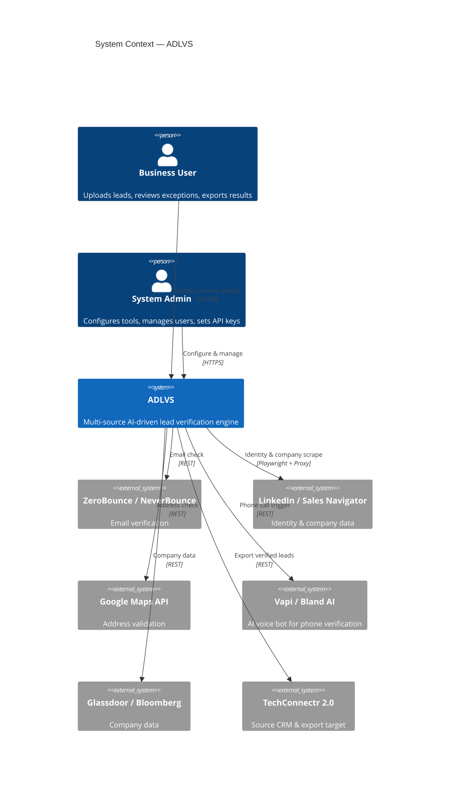
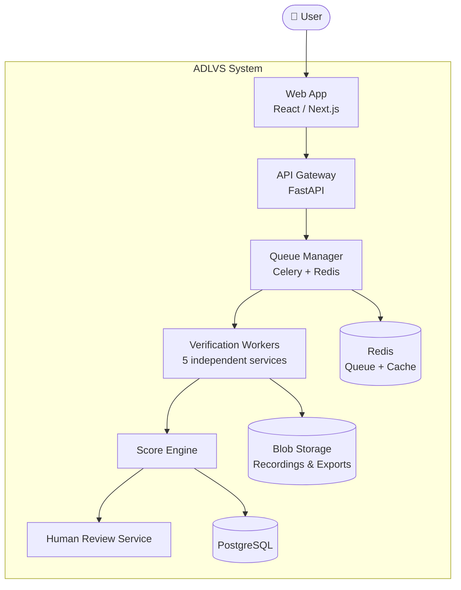
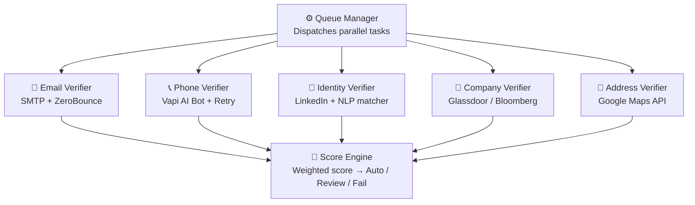
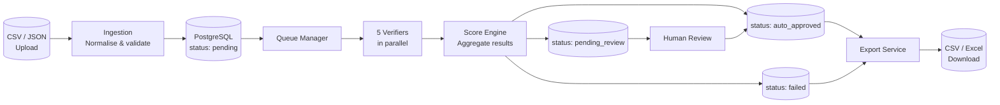

# System Architecture

The architecture uses three levels of zoom. Read them top to bottom — each one reveals more detail than the last.

| Level | Shows | Audience |
|---|---|---|
| **Context** | What the system connects to externally | Everyone |
| **Containers** | What services and databases exist inside | Tech lead, DevOps |
| **Components** | How the verification engine works internally | Developers |

---

## Level 1 — System Context

What ADLVS connects to. Every box outside the centre is an external dependency.

---

## Level 2 — Containers

The key services and data stores. Each box is a separately deployable unit.

---

## Level 3 — Inside the Verification Engine

Each verifier runs independently. They all report back to the Score Engine.

---

## Data Flow

How a lead record moves and changes state through the system.

