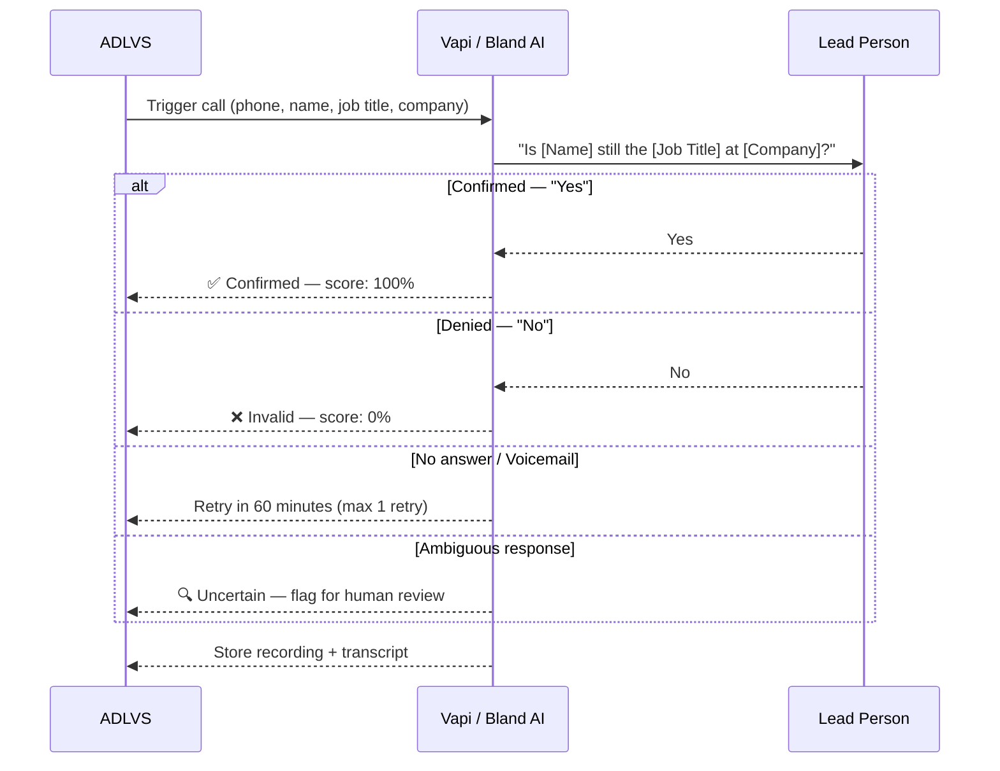
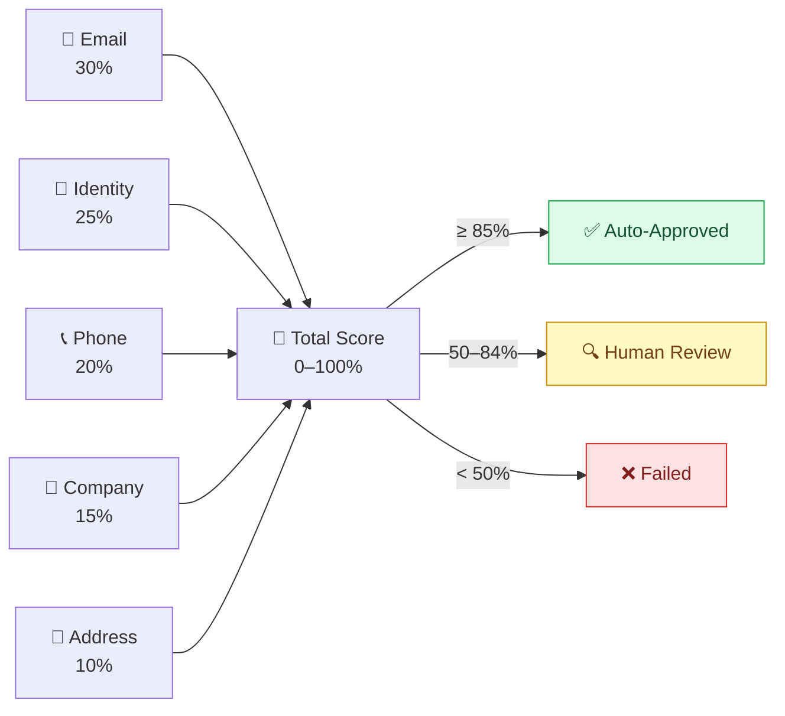
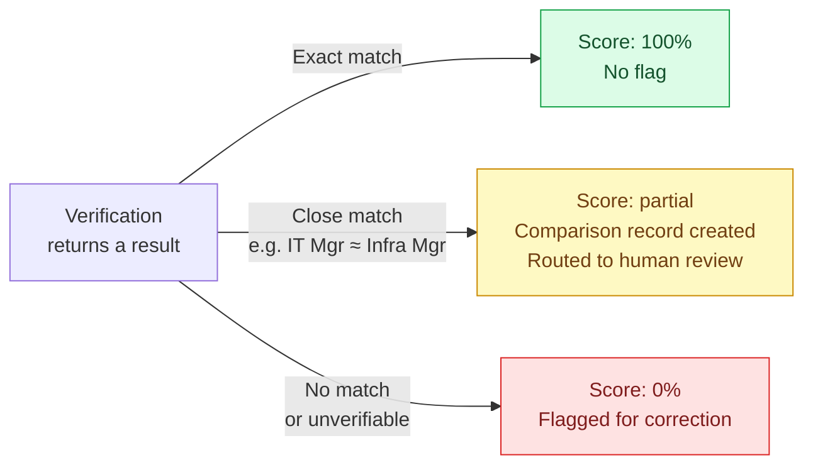

# Key Features

---

## AI Voice Bot — Phone Verification

Instead of staff manually calling to verify a lead's phone number, an AI bot does it automatically during business hours. The bot asks a simple yes/no question, transcribes the answer, and records the outcome.

---

## Confidence Score — How Leads Are Scored

Every verified field contributes a weighted score. The total decides what happens to the lead.

### Weight Reference

| Data Point | Weight | Verified By |
|---|---|---|
| Email | 30% | SMTP check + ZeroBounce API |
| Job Title / Identity | 25% | LinkedIn profile via AI matcher |
| Phone | 20% | AI voice bot |
| Company size & industry | 15% | Glassdoor / Bloomberg |
| Address | 10% | Google Maps |

### Worked Example — Catch-All Email Lead

| Check | Result | Points |
|---|---|---|
| Email — catch-all domain (risky) | 50% | 15 |
| Identity — LinkedIn confirmed | 100% | 25 |
| Phone — AI bot confirmed | 100% | 20 |
| Company — matched | 100% | 15 |
| Address — partial match | 70% | 7 |
| **Total** | | **82% → Human Review** |

A human glances at this for 10 seconds and confirms. No 20-minute manual search needed.

> Weights are stored in the database per campaign — not hardcoded. Different campaigns can use different scoring profiles.

---

## Mismatch Handling — Not Binary Pass or Fail

When a field doesn't exactly match, the system does **not** fail the lead outright. Instead it creates a **comparison record** and routes the lead to human review.

**Example:** Lead says "IT Manager" — LinkedIn says "Infrastructure Manager". A human would recognise these as the same role. The system flags the mismatch with an AI similarity note and lets a human confirm rather than auto-failing a valid lead.

---

## Telemarketing Mode

For telemarketing leads, the AI bot runs in an extended mode — the full call is recorded and the transcript is stored alongside the lead record. Both are available in the export and human review screens.

| Mode | Bot behaviour | Output |
|---|---|---|
| **Standard verification** | Short script, yes/no answer, ends call | Confirmed / Invalid / Uncertain |
| **Telemarketing** | Full conversation recorded | Recording file + full transcript attached to lead |

---

## Admin Configuration

Admins can configure which verification tool to use for each data point, per campaign. This means different clients or campaigns can use different providers without changing any code.

| What can be configured | Example |
|---|---|
| Email verifier | Choose ZeroBounce, NeverBounce, or SMTP-only |
| Identity source | LinkedIn, company website, or both |
| Scoring weights | Adjust per-campaign (e.g. weight phone higher for sales campaigns) |
| Score thresholds | Change the auto-approve and review cutoffs |
| Rate limits | Set per-service concurrency limits to match subscription tier |
