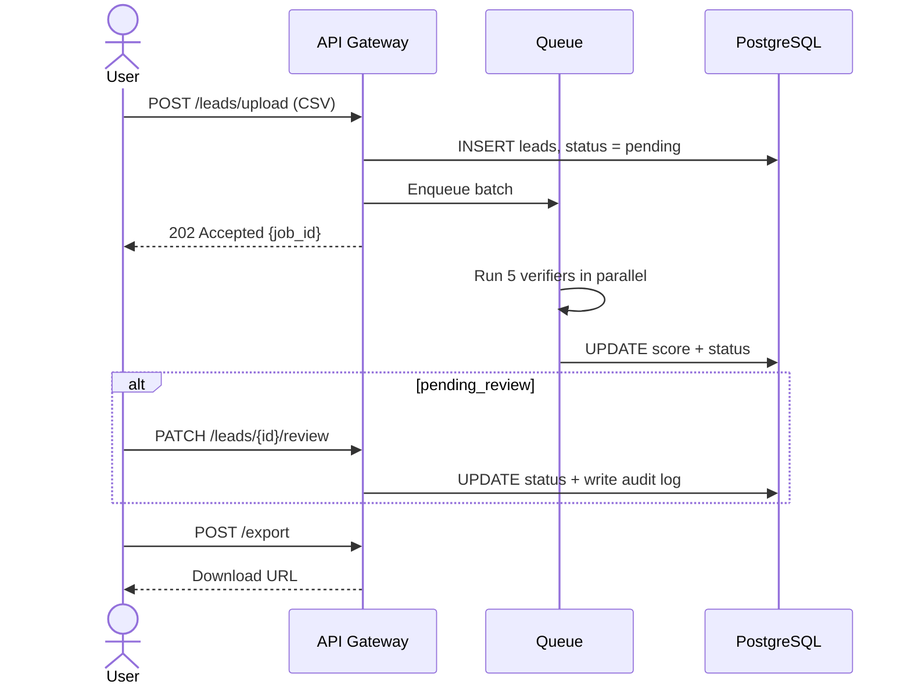
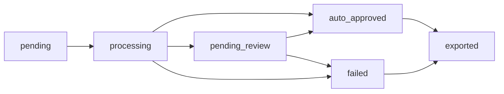
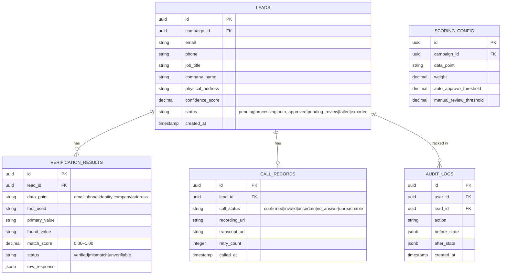
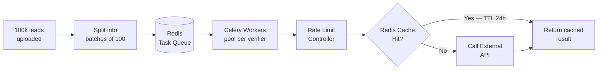

# Developer Reference

---

## API & Lead Lifecycle



### Lead Status Transitions



### Key API Endpoints

| Method | Endpoint | Purpose |
|---|---|---|
| POST | `/leads/upload` | Upload CSV/JSON batch |
| GET | `/leads/status/{job_id}` | Poll processing progress |
| GET | `/leads/review-queue` | Fetch items for human review |
| PATCH | `/leads/{id}/review` | Submit human decision |
| POST | `/export` | Generate CSV/Excel export |

---

## Database Schema

Key design decision: `verification_results` is a separate table from `leads`. Adding a new verifier (e.g. Twitter check) requires zero changes to the leads schema.



---

## Queue Model & the 3-Hour SLA

The 3-hour target is only achievable by running verifications in parallel **and** respecting each external API's rate limit. Without proxy rotation, LinkedIn alone would take 27 hours.



### Rate Limits per External Service

| Service | Limit | Strategy |
|---|---|---|
| ZeroBounce | 100 req/sec | High parallelism, no proxy needed |
| Google Maps | 50 req/sec | Managed quota |
| Vapi / Bland AI | 10 concurrent calls | Business hours scheduling |
| LinkedIn | 5 req/sec per IP | Proxy rotation × 20 IPs = 100 req/sec |
| Glassdoor / Bloomberg | 3 req/sec | Proxy rotation |

### Why This Hits the SLA

```
500,000 API calls total (100k leads × 5 checks)

Without proxy:  LinkedIn at 5 req/sec = 27 hours  ❌
With 20 proxies: 100 req/sec            = 83 min   ✅
With 20% cache:  400k real calls        = 67 min   ✅
```
