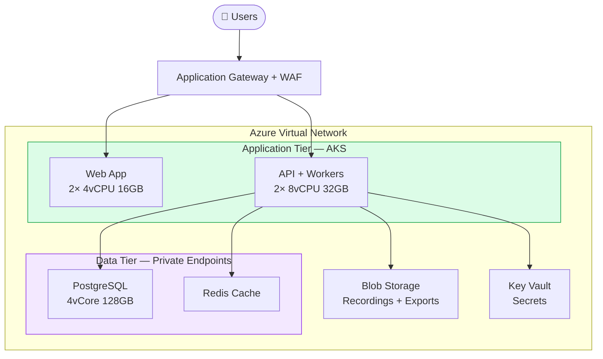
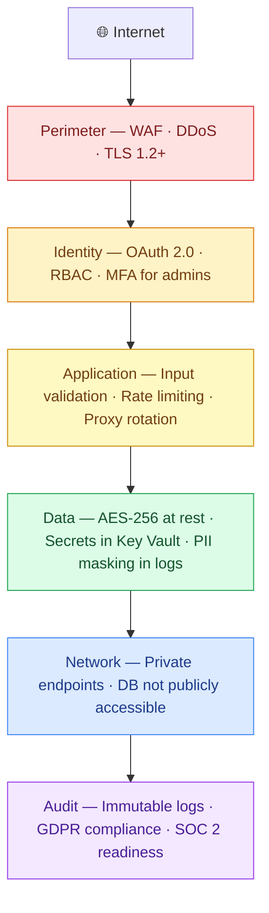
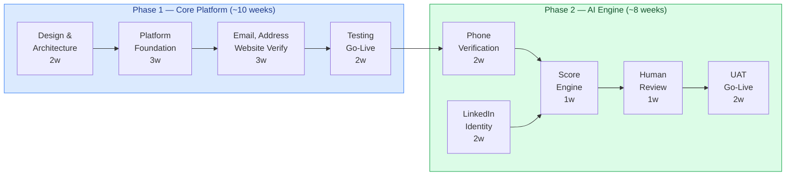

# Infrastructure

---

## Deployment — Azure (Recommended)

### Azure Service Map

| Component | Azure Service |
|---|---|
| Web + API containers | AKS / App Service |
| Celery workers | VM Scale Set / AKS |
| Scheduled jobs | Azure Functions |
| Database | Azure DB for PostgreSQL |
| Cache + Queue | Azure Cache for Redis |
| File storage | Azure Blob Storage |
| Secrets | Azure Key Vault |
| WAF | Application Gateway WAF v2 |
| Logging | Azure Monitor + Log Analytics |

---

## Deployment — AWS (Alternative)

Same architecture, different service names. Choose based on your team's existing cloud expertise.

| Concern | Azure | AWS |
|---|---|---|
| Containers | AKS / App Service | ECS Fargate / EKS |
| Serverless jobs | Azure Functions | Lambda + EventBridge |
| Database | Azure DB for PostgreSQL | RDS PostgreSQL |
| Cache | Azure Cache for Redis | ElastiCache Redis |
| Storage | Azure Blob Storage | S3 |
| Secrets | Azure Key Vault | AWS Secrets Manager |
| WAF | Application Gateway WAF | AWS WAF + ALB |
| Logging | Azure Monitor | CloudWatch + X-Ray |

---

## Deployment — On-Premises (Minimum Spec)

For clients who cannot use cloud providers. Sized for 100,000 leads/day.

| Component | Minimum Spec |
|---|---|
| Application servers | 2 × 16-core CPU, 64GB RAM |
| Database server | 16-core CPU, 128GB RAM, RAID SSD |
| Storage | 2TB SSD + 4TB HDD (recordings, logs, exports) |
| Network | 1Gbps LAN, DMZ |
| Software | Ubuntu / RHEL, Docker, PostgreSQL, Redis, Prometheus + Grafana |

---

## Security Layers

Defense is built in layers — if one fails, the next stops the breach.

---

## CI/CD Pipeline

Security gates (SAST, dependency scan, image scan) are mandatory blockers — not warnings.

```mermaid
flowchart LR
    PR["Pull Request"]

    subgraph CI["CI — GitHub Actions / Azure DevOps"]
        LNT["Lint"]
        TST["Unit Tests"]
        SAS["SAST\nBandit / SonarQube"]
        DEP["Dependency\nScan"]
        BLD["Docker Build"]
        INT["Integration\nTests"]
        IMG["Image Scan\nTrivy"]
        LNT --> TST --> SAS --> DEP --> BLD --> INT --> IMG
    end

    PR --> LNT
    IMG --> STG["Deploy to Staging"]
    STG --> PERF["Performance Test\n100k leads"]
    PERF --> APPR["Manual Approval"]
    APPR --> PROD["Blue/Green\nto Production"]
    PROD --> HC{"Health Check"}
    HC -->|Pass| DONE["Live ✅"]
    HC -->|Fail| RB["Auto Rollback"]

    style SAS fill:#fee2e2,stroke:#dc2626,color:#7f1d1d
    style DEP fill:#fee2e2,stroke:#dc2626,color:#7f1d1d
    style IMG fill:#fee2e2,stroke:#dc2626,color:#7f1d1d
    style RB fill:#fee2e2,stroke:#dc2626,color:#7f1d1d
```

---

## Phased Delivery

### Phase Deliverables

| Phase | Deliverable |
|---|---|
| **Phase 1** | Core platform — email, address, website verification. Basic dashboard and export. |
| **Phase 2** | AI voice bot, LinkedIn identity check, confidence scoring, human review workflow, full reporting. |
